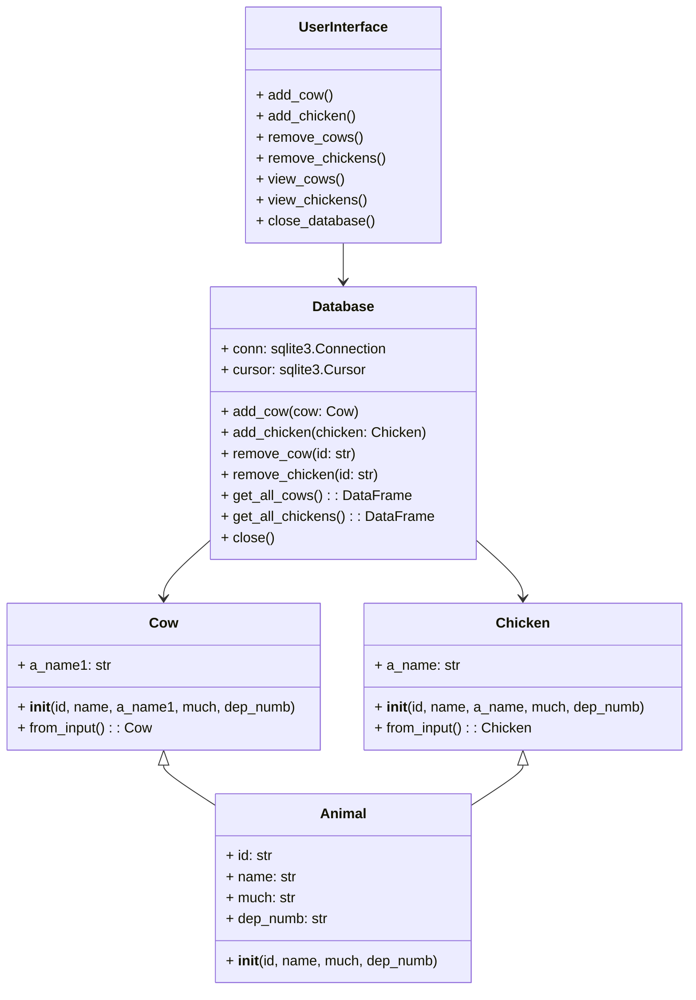

# Обліковець  

## Опис програми  
Програма "Обліковець" призначена для обліку тваринницької діяльності на фермі. Вона дозволяє вести облік корів та курей, зберігати дані про їх продуктивність та керувати інформацією.  

## Структура проекту  

### Компоненти системи  
1. **Моделі даних (`models.py`)**  
   - `Animal` - базовий клас для всіх тварин.  
   - `Cow` - клас для обліку корів.  
   - `Chicken` - клас для обліку курей.  

2. **База даних (`db.sql`)**  
   Таблиці:  
   - `animal` - довідник типів тварин.  
   - `cows` - дані про корів.  
   - `chickens` - дані про курей.  

3. **Інтерфейс бази даних (`database_interface.py`)**  
   Класи:  
   - `Database` - клас для роботи з БД.  
   - `UserInterface` - клас для взаємодії з користувачем.  

### UML-діаграма

## Інструкція з використання  
1. Запустіть програму.  
2. У головному меню оберіть одну з функцій:  
   - Додавання нової інформації.  
   - Перегляд даних.  
   - Видалення записів.  
   - Вихід.  
3. Дотримуйтесь підказок програми для введення необхідної інформації.  

## Вимоги до системи  
- Python 3.x  
- SQLite3  
- Pandas  

## Підтримка та оновлення  
1. **Резервне копіювання.**  
   Перед оновленням програми зробіть резервну копію бази даних.  

2. **Оновлення.**  
   Оновіть файли програми до нової версії.  

3. **Перевірка сумісності.**  
   Перевірте сумісність структури бази даних з оновленою програмою.  
