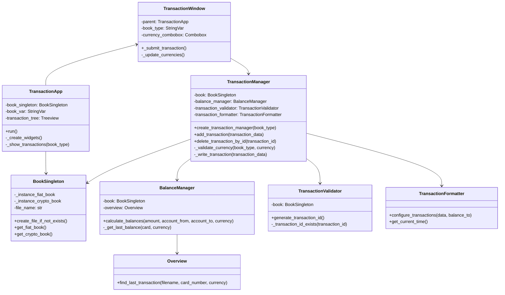

# Система управління транзакціями

## Опис програми
Програма представляє собою систему управління транзакціями з підтримкою фіатних та криптовалютних операцій. Реалізовано можливість створення, видалення та перегляду транзакцій через графічний інтерфейс. Система підтримує автоматичний розрахунок балансів та валідацію операцій.

## Стек технологій
- **Python 3.x**
- **tkinter** - для створення GUI
- **csv** - для роботи з файлами даних
- **datetime** - для роботи з датами
- **random, string** - для генерації унікальних ідентифікаторів

## Основні файли та класи

### 1. **gui.py**
- **TransactionApp**  
  - Головний клас GUI програми.  
  - Створює основне вікно програми.  
  - Управляє відображенням транзакцій.  
  - Обробляє взаємодію з користувачем.  

- **TransactionWindow**  
  - Клас для створення нових транзакцій.  
  - Забезпечує форму введення даних.  
  - Реалізує валідацію введених даних.  

### 2. **transaction_manager.py**
- **BookSingleton**  
  - Реалізує патерн Singleton для книг транзакцій.  
  - Управляє створенням та доступом до файлів транзакцій.  
  - Забезпечує єдину точку доступу до даних.  

- **TransactionManager**  
  - Основний клас управління транзакціями.  
  - Реалізує функції додавання/видалення записів, валідацію операцій.  
  - Взаємодіє з файловою системою.  

- **BalanceManager**  
  - Управляє балансами.  
  - Розраховує баланси.  
  - Перевіряє достатність коштів.  

- **Overview**  
  - Аналізує транзакції.  
  - Пошук останніх транзакцій.  
  - Отримання історії операцій.  

### 3. **dialogs.py**
- Містить допоміжні функції для створення діалогових вікон.  
- Обробляє взаємодію з користувачем при помилках та введенні даних.  

## Файли даних
- **fiat_book.csv** - зберігає фіатні транзакції.  
- **crypto_book.csv** - зберігає криптовалютні транзакції.  

## UML-діаграма класів

