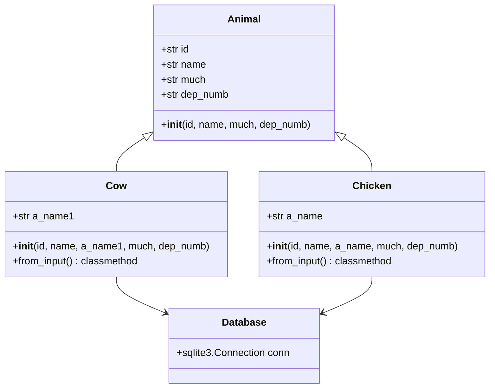

**МІНІСТЕРСТВО ОСВІТИ І НАУКИ УКРАЇНИ**

**ЛЬВІВСЬКИЙ НАЦІОНАЛЬНИЙ УНІВЕРСИТЕТ ПРИРОДОКОРИСТУВАННЯ**

**ФАКУЛЬТЕТ МЕХАНІКИ, ЕНЕРГЕТИКИ ТА ІНФОРМАЦІЙНИХ ТЕХНОЛОГІЙ**

**КАФЕДРА ІНФОРМАЦІЙНИХ ТЕХНОЛОГІЙ**

**Курсова робота**

із дисципліни «Об'єктно-орієнтоване програмування»

на тему: **«Розробка автоматизованої системи обліку роботи тваринницького підприємства»**

Виконав: студент 3 курсу групи Іт-31

Спеціальності 126 «Інформаційні системи та технології»					

(шифр і назва)

Швець І.О.				

(Прізвище та ініціали)

Керівник: 	к.т.н., професор Татомир А.В.	

(Прізвище та ініціали)

**ДУБЛЯНИ-2024**

**Львівський національний університет природокористування**

**ЗАВДАННЯ**

на курсову роботу з дисципліни 

***«***Об'єктно-орієнтоване програмування***»***

#### Студенту групи Iт-31      Швецю І.О.
`                                                                            `*(прізвище та ініціали)*

**1. Тема роботи** «Розробка автоматизованої системи обліку роботи тваринницького підприємства»

**2. Термін здачі студентом закінченої роботи 06.12.24**

**3. Індивідуальне завдання роботи**:

\-реалізувати систему обліку персоналу та тварин таким чином, щоби відображати розподіл відповідальності працівників за окремих тварин; 

\-передбачити можливість вводити показники ефективності кожної тварини (приріст маси, надої молока тощо); 

\-виводити основні метрики по фермі загалом та по персоналу; 

\-зберігати дані між запусками програми. 

**4. Перелік питань, які необхідно розробити в роботі:**

*Реферат.* Вступ.

1\. АНАЛІЗ СУЧАСНОГО СТАНУ ПИТАННЯ ТА ОБҐРУНТУВАННЯ ЗАВДАННЯ НА РОБОТУ.

1\.1. Аналіз предмету проектування.

1\.2. Класифікація об'єктно-орієнтованих мов програмування.

1\.3. Огляд та аналіз сучасних технологій та засобів проектування програмного забезпечення.

1\.4. Уточнена постановка задачі на розробку програмного забезпечення.

2\. РОЗРОБКА ЗАГАЛЬНОЇ СТРУКТУРИ ПРОГРАМИ ТА ІЄРАРХІЇ КЛАСІВ. 

2\.1. Аналіз функцій системи. 

2\.2. Декомпозиція системи. 

2\.3. Аналіз взаємозв’язків між об’єктами. 

2\.4. Розроблення інтерфейсів класів. 

2\.5. Розроблення структурної моделі системи і UML-діаграми класів. 

3\. РОЗРОБКА КОРИСТУВАЦЬКОГО ІНТЕРФЕЙСУ.

4\. ТЕСТУВАННЯ ПРОГРАМНОГО ЗАБЕЗПЕЧЕННЯ І РОЗРОБКА ДОКУМЕНТАЦІЇ ДЛЯ СУПРОВОДЖЕННЯ ПРОГРАМНОГО ПРОДУКТУ.

Висновки.

Бібліографічний список

ДОДАТОК A. КОД ПРОГРАМИ(database_interface.py) 

ДОДАТОК Б. КОД ПРОГРАМИ(models.py) 

ДОДАТОК В. СТВОРЕННЯ БАЗИ ДАНИХ(da.sql) 

**5. Консультанти з розділів курсової роботи:** А. Татомир

**6. Дата видачі завдання** 23.09.2024 року

**7. Дні і години консультацій**

**8. Завдання на курсову роботу затверджено на засіданні кафедри інформаційних систем і технологій** 

**Протокол №\_\_\_ від \_\_\_\_\_\_\_\_\_\_\_\_20\_\_\_р.**

Керівник роботи: 					А. Татомир

Завдання прийняв до виконання (дата, підпис) \_\_\_\_\_\_\_\_\_\_\_\_\_\_\_\_\_\_\_\_\_\_\_\_

# **ВСТУП**
Об’єктно-орієнтоване програмування (ООП) — це парадигма програмування, тобто модель або стиль програмування, який містить вказівки щодо того, як з ним працювати, і базується на концепції класів та об’єктів. Цей тип програмування використовується для структурування програмного забезпечення в простих і багаторазово використовуваних частинах площин коду (класів) для створення окремих екземплярів об’єктів. Мета парадигми ООП полягає в тому, щоб перестати зосереджуватися на чистій логіці програм і почати думати про об’єкти, що є основою цієї парадигми. Це дуже допомагає у великих системах, тому що замість того, щоб мислити функціями, ми думаємо про відносини або взаємодії різних елементів системи. Програміст розробляє програмне забезпечення, організовуючи фрагменти інформації та пов’язану поведінку в шаблон, який називається класом. Потім із шаблону класу створюються окремі об’єкти. Уся програмна програма виконується шляхом взаємодії різних об’єктів один з одним для створення більшої програми. 

Автоматичний облік процесів як у тваринництві так і у всіх інших сферах є великим кроком для підвищення оптимізації ресурсів та ефективності. Сучасні реалії ринкової конкуренції змушують підприємства шукати способи вдосконалення своїх систем управління, щоб гарантувати якісну продукцію й отримувати максимальний прибуток. Автоматизовані системи обліку дозволяють підприємствам ефективно організовувати дані про персонал і тварин, контролювати виробничі процеси й аналізувати ключові показники ефективності. Такі системи зменшують помилку за рахунок людського фактору та підвищують раціональність використання ресурсів. Для того, щоб зробити автоматизовану систему обліку потрібно проаналізувати вимоги системи, розробку функціоналу та продумати можливі майбутні розширення проекту. Основними компонентами системи є облік персоналу, ведення даних кожну тварину й належне зберігання цих даних та їх відображення при огляді.  У розробці системи будуть застосовані основні принципи ООП, такі як абстракція, інкапсуляція й спадкування. Ці принципи забезпечать модульність і гнучкість системи, що є критично важливим для задоволення потреб підприємств у мінливих умовах ринку. 

# **РОЗДІЛ 1.** 
# **АНАЛІЗ СУЧАСНОГО СТАНУ ПИТАННЯ ТА ОБГРУНТУВАННЯ ЗАВДАННЯ НА РОБОТУ**

**1.1 Аналіз предмету проектування.**

У забезпеченні продовольчої безпеки ключову роль відіграє тваринницька галузь, адже саме завдяки їй ми отримуємо м'ясо, молоко, вовну та інші важливі продукти. Однак управління тваринницькими підприємствами з кожним роком стає складнішим. Це зумовлено як зростанням обсягів даних для аналізу, так і збільшенням кількості об'єктів, якими потрібно керувати: від поголів'я худоби до обслуговуючого персоналу й технічного оснащення. У цих умовах підприємства дедалі частіше звертаються до оптимізації управлінських процесів, щоб збільшити стабільно високий рівень продуктивності. 

Впровадження автоматизованої системи обліку дозволяє інтегрувати облік персоналу, моніторинг стану здоров’я тварин, контроль продуктивності та планування основних виробничих операцій. За результатами досліджень, використання таких систем допомагає знизити втрати, спричинені помилками у документації, на 25–30%, а продуктивність праці зростає на 15–20%. Завдяки автоматизації значно скорочується час на виконання рутинних завдань, а ресурси підприємства використовуються ефективніше.  

Мета цього проєкту — розробити систему, яка допоможе підприємствам зручно збирати, обробляти та зберігати інформацію про всі аспекти їхньої роботи. Зокрема, система має забезпечувати зберігання даних у базі, автоматичну перевірку на дублікати, а також зручний доступ до потрібної інформації. Важливо, щоб рішення було простим у використанні та дозволяло масштабуватися в міру зростання обсягів виробництва. 

**1.2 Класифікація об'єктно-орієнтованих мов програмування.**

Об’єктно-орієнтовані мови програмування (ООП) стали основою для розробки програмного забезпечення завдяки своїм основним принципам: інкапсуляція, наслідування та поліморфізм. Вони дозволяють організовувати код у вигляді об’єктів. Об'єкти – це екземпляри класів, що представляють реальні або абстрактні сутності. Класифікація об’єктно-орієнтованих мов програмування може здійснюватися за кількома критеріями, такими як рівень абстракції, а також підтримка основних принципів ООП. 

Історично виникли різні парадигми програмування. З одного боку, процедурні мови, такі як Basic або C, більше зосереджуються на логіці, ніж на даних. З іншого боку, більш сучасні мови, такі як Java, C# і Python, використовують парадигми для визначення програм, причому ООП є найпопулярнішим. 

Мови програмування можна класифікувати за кількома критеріями. Наприклад, за рівнем підтримки ООП: деякі мови, як Java, C# і Python, мають повну підтримку ООП, тоді як інші, як C і JavaScript, підтримують ООП частково. Також мови можна розділити за типізацією: статично типізовані мови, такі як C++ і Java, визначають типи під час компіляції, що дозволяє виявляти помилки на ранніх етапах, тоді як динамічно типізовані мови, як Python і Ruby, визначають типи під час виконання, що надає більшу гнучкість. 

Таким чином, класифікація об'єктно-орієнтованих мов допомагає краще зрозуміти їх можливості й обрати ту, що найбільше відповідає потребам проєкту. Вибір залежить від багатьох факторів, як-от ефективність, гнучкість і можливість масштабування програмного забезпечення. 

**1.3 Огляд та аналіз сучасних технологій та засобів проектування програмного забезпечення.**

Сучасні технології та інструменти розробки програмного забезпечення значно впливають на швидкість, якість і загальну ефективність створення програмних продуктів. У світі, де конкуренція на ринку ІТ постійно зростає, а бізнес-вимоги змінюються чи не щодня, розробникам доводиться працювати з найновішими інструментами та методологіями. Це дозволяє спрощувати процеси розробки, робити програмне забезпечення більш масштабованим і легшим у підтримці. 

Одним із найбільш популярних підходів є об'єктно-орієнтоване проектування (ООП), яке дозволяє уявляти програмну систему як набір об'єктів, що взаємодіють між собою. Такий підхід ідеально підходить для створення великих і складних проєктів, де критично важливі модульність і гнучкість. Завдяки ООП можна зменшити складність системи, спростити її масштабування та ефективніше використовувати вже написаний код. 

Для візуалізації структури та взаємозв'язків у програмній системі часто застосовують UML-діаграми. Вони дають змогу краще зрозуміти архітектуру програми, побачити зв'язки між об'єктами й уявити ключові процеси всередині системи. Такий підхід особливо корисний під час етапу проектування, адже допомагає створити чітку модель, яка спрощує роботу всіх учасників проєкту: розробників, аналітиків і замовників. 

Також варто згадати методології Agile і DevOps, які разом із сучасними інструментами для автоматизації тестування та інтеграції значно підвищують продуктивність команд. Вони дозволяють швидко реагувати на зміни у вимогах і створювати якісне програмне забезпечення в умовах динамічного середовища. 

Agile методологія — це ітеративний підхід до управління проектами та розробки програмного забезпечення, який використовує цикли зворотного зв’язку та тестову розробку для вирішення проблем. Це не окремий метод, а набір найкращих практик, які передбачають постійну співпрацю. Гнучкі методи зосереджені на здатності команди бути гнучкими, заохочуючи членів команди виявляти невизначеності у своїх проектах і адаптуватися до викликів. 

DevOps — ще одна важлива технологія, яка дозволяє інтегрувати процеси розробки і експлуатації програмного забезпечення. DevOps сприяє автоматизації тестування, збору і розгортання програмних продуктів, що дає змогу знижувати витрати на підтримку та пришвидшувати доставку програмного забезпечення кінцевим користувачам. Інструменти, такі як Jenkins, Docker, Kubernetes, активно використовуються для автоматизації різних етапів розробки та тестування. 

Також важливим аспектом сучасного проектування є використання хмарних технологій для розробки і розгортання програмних продуктів. Платформи, як AWS, Microsoft Azure або Google Cloud, дозволяють зберігати дані та розгортати програмні системи без необхідності підтримки власної інфраструктури, що значно знижує витрати та збільшує гнучкість у використанні ресурсів. Хмарні сервіси також надають зручні інструменти для масштабування програм, їх інтеграції та обслуговування. 

Завдяки використанню таких технологій і засобів проектування програмного забезпечення можна значно підвищити ефективність розробки, забезпечити високу якість кінцевого продукту і знизити витрати на підтримку і розвиток програмних систем. Зрозуміле та модульне проектування, а також інтеграція з новітніми інструментами для тестування та автоматизації допомагають зменшити час на виправлення помилок, прискорюють процеси розгортання та забезпечують високу стабільність роботи програмного продукту в майбутньому.  

**1.4 Уточнена постановка задачі на розробку програмного забезпечення.**

Розробка програмного забезпечення для автоматизованої системи обліку роботи тваринницького підприємства має на меті створення простої та ефективної системи для ведення обліку. Програма дозволить реєструвати працівників із зазначенням їхніх ідентифікаційних номерів, імен, а також номерів тварин, за якими вони доглядають. Окрім цього, система забезпечить можливість введення даних про кількість продукції, виробленої кожною твариною. Такий підхід допоможе спростити облік, знизити ризик помилок та забезпечити швидкий доступ до необхідної інформації для аналізу продуктивності працівників і тварин. 

Основними вимогами до програмного продукту є створення простого та зручного інтерфейсу для користувачів системи. Необхідно забезпечити можливість перегляду та аналізу основних показників роботи підприємства, таких як загальний обсяг виробництва, кількість записаних одиниць продукції, а також дані щодо працівників і тварин. Програма дозволить швидко оглянути внесені дані, що забезпечить зручність у прийнятті рішень для покращення управлінських і виробничих процесів. 

Для досягнення цієї мети система повинна бути побудована на основі об’єктно-орієнтованого підходу з використанням сучасних методів програмування і проектування, що дозволить легко масштабувати програму в майбутньому, інтегрувати нові модулі та функціональність. 

Таким чином, уточнене завдання розробки програмного забезпечення для автоматизованої системи обліку роботи тваринницького підприємства полягає в створенні ефективної, масштабованої та зручної системи, що дозволить автоматизувати управлінські процеси, здійснювати точний облік та моніторинг діяльності підприємства. 

# **РОЗДІЛ 2.** 
# ` `**РОЗРОБКА ЗАГАЛЬНОЇ СТРУКТУРИ ПРОГРАМИ**

**2.1 Аналіз функцій системи**;

Функціональний аналіз системи обліку тваринницького підприємства демонструє набір можливостей для ефективного управління даними про працівників та їхню роботу з тваринами. Розглянемо основні функції системи: 

Додавання нових даних: 

    Введення унікального ідентифікатора працівника 

    Запис імені працівника 

    Внесення інформації про тварин (коди корів або кількість курей) 

    Фіксація показників продуктивності (літри молока або кількість яєць) 

    Зазначення номера відділу 

    Захист від дублювання ідентифікаторів 

Перегляд існуючих даних: 

    Виведення повної інформації про працівників з коровами 

    Виведення повної інформації про працівників з курми 

    Представлення даних у форматі зручної таблиці 

    Можливість повернення до головного меню 

Видалення даних: 

    Видалення записів за ідентифікатором працівника 

    Вибір категорії (корови/кури) для видалення 

    Підтвердження успішного видалення 

Додаткові особливості: 

    Зручна навігація через консольне меню 

    Обробка помилок введення 

    Надійне збереження даних у базі SQLite 

    Інформативні повідомлення про результати операцій 

Система забезпечує повний цикл управління даними та дозволяє ефективно вести облік роботи персоналу тваринницького підприємства, зберігаючи всю необхідну інформацію у структурованому вигляді. 

**2.2 Декомпозиція системи.**

Декомпозиція системи - це методологія розділення складної системи на менші, більш керовані компоненти для спрощення розробки та обслуговування. У контексті системи обліку тваринницького підприємства можна виділити наступну структуру: 

Основні компоненти системи: 

Базовий компонент обліку (клас Animal): 

    Забезпечує базову структуру даних про працівника 

    Містить універсальні атрибути: id (ідентифікатор), name (ім'я працівника), much (показники продуктивності), dep_numb (номер відділу) 

    Реалізує принцип єдиної відповідальності (SRP), зберігаючи тільки основні дані 

Спеціалізований компонент обліку корів (клас Cow): 

    Розширює базовий компонент 

    Додає специфічний атрибут a_name1 для кодів корів 

    Реалізує метод from_input() для збору даних про роботу з коровами 

Спеціалізований компонент обліку курей (клас Chicken): 

    Також розширює базовий компонент 

    Містить атрибут a_name для обліку кількості курей 

    Має власну реалізацію методу from_input() для збору даних про роботу з курми 

Компонент роботи з базою даних: 

    Забезпечує з'єднання з SQLite 

    Відповідає принципу інверсії залежностей (DIP) 

    Ізолює логіку роботи з даними від інших компонентів 

**2.3 Аналіз взаємозв’язків між об’єктами.**

Аналіз взаємозв’язків між об’єктами у системі обліку тваринницького підприємства показує, як різні класи взаємодіють між собою, утворюючи ієрархічну структуру. У центрі цієї системи знаходиться базовий клас Animal, який визначає спільні характеристики для всіх видів тварин. Від нього наслідуються спеціалізовані класи, такі як Cow та Chicken. 

Клас Cow успадковує від базового класу всі основні параметри, характерні для тварин, і додає властивості, які є унікальними для корів. Аналогічно, клас Chicken наслідує базові атрибути від Animal, адаптуючи їх для обліку курей. Така структура забезпечує ефективне розширення функціональності, дозволяючи додавати нові типи тварин із мінімальними змінами в існуючій архітектурі. Взаємозв’язки між об’єктами базуються на принципах успадкування та поліморфізму, що сприяє зменшенню дублювання коду та підвищенню гнучкості системи. 

Важливим аспектом взаємодії є зв'язок з базою даних через об'єкт conn, який створюється на рівні модуля. Це з'єднання використовується для збереження та отримання даних про працівників та їх показники роботи. Така архітектура забезпечує централізоване управління даними та підтримує принцип єдиної відповідальності, де кожен компонент системи відповідає за конкретний аспект функціональності. 

Взаємодія між компонентами системи побудована таким чином, що зміни в одному класі мінімально впливають на інші частини системи, що відповідає принципам слабкого зв'язування та високої згуртованості. Це досягається через чітке розділення відповідальності між класами та використання механізму успадкування для розширення функціональності. 

**2.4 Розроблення інтерфейсів класів.**

Розробка інтерфейсів класів для системи обліку тваринницького підприємства передбачає створення чіткої структури взаємодії між компонентами системи. Розглянемо інтерфейси основних класів системи: 

Базовий клас Animal визначає загальний інтерфейс для всіх типів працівників з тваринами. Він містить конструктор init, який приймає основні параметри: id (ідентифікатор працівника), name (ім'я працівника), much (кількісний показник роботи) та dep_numb (номер відділу). Цей інтерфейс забезпечує базову структуру даних, яка використовується всіма похідними класами. Клас Cow розширює базовий інтерфейс Animal, додаючи специфічний атрибут a_name1 для зберігання кодів корів. Його інтерфейс включає конструктор init з розширеним набором параметрів та класовий метод from_input(), який забезпечує інтерактивне введення даних про працівника з коровами. Метод from_input() реалізує користувацький інтерфейс для збору всієї необхідної інформації про працівника та його роботу з коровами.  

Клас Chicken також розширює інтерфейс Animal, додаючи власний атрибут a_name для обліку кількості курей. Його інтерфейс аналогічний до класу Cow, але адаптований під специфіку роботи з курми. Метод from_input() реалізує введення даних, специфічних для працівників, що працюють з курми, включаючи кількість курей та показники збору яєць. Взаємодія з базою даних забезпечується через об'єкт підключення conn, який створюється на рівні модуля та використовується для збереження та отримання даних. Цей інтерфейс забезпечує надійне збереження інформації та доступ до неї через стандартні методи SQLite.  

**2.5 Розроблення структурної моделі системи і UML-діаграми класів.**

Розроблення структурної моделі системи обліку тваринницького підприємства та UML-діаграми класів дозволяє візуалізувати архітектуру системи та взаємозв'язки між її компонентами. 

Структурна модель системи складається з трьох основних рівнів: 

На верхньому рівні знаходиться абстрактний базовий клас Animal, який визначає загальну структуру даних для всіх типів працівників. Цей клас містить атрибути: 

- id: str (ідентифікатор працівника) 

- name: str (ім'я працівника) 

- much: str (кількісний показник роботи) 

- dep_numb: str (номер відділу) 

На середньому рівні розташовані два спеціалізовані класи, які успадковують функціональність від Animal: 

Клас Cow додає специфічні характеристики для працівників з коровами: 

- a_name1: str (коди корів) 

- from_input(): classmethod (метод введення даних) 

Клас Chicken розширює базовий функціонал для працівників з курми: 

- a_name: str (кількість курей) 

- from_input(): classmethod (метод введення даних) 

На нижньому рівні знаходиться компонент роботи з базою даних: 

- conn: sqlite3.Connection (з'єднання з базою даних) 

UML-діаграма класів відображає ці взаємозв'язки через відношення успадкування (стрілки від Cow та Chicken до Animal) та асоціації (зв'язок класів з компонентом бази даних). Така структура забезпечує чітку ієрархію класів та ефективне управління даними в системі. 

# **РОЗДІЛ 3.** 
# ` `**РОЗРОБКА КОРИСТУВАЦЬКОГО ІНТЕРФЕЙСУ.**

Інтерфейс програми розроблений зручно для користувачів. В головному меню є чотири основних функції додавання нової інформації, перегляд існуючих даних, видалення записів та вихід з програми. При виборі опції додавання даних користувач потрапляє до підменю, де може обрати тип тварин данні про які він хоче внести. Система послідовно запитує необхідні дані, такі як ідентифікатор працівника, ім'я, показники роботи та номер відділу. 

Функція перегляду даних запитує у користувача дані про яких тварин він хоче оглянути та відображає інформацію у форматованому вигляді за допомогою бібліотеки pandas, що забезпечує чітке та структуроване представлення даних. Видалення записів також реалізоване через зручне підменю, де користувач може вказати ідентифікатор запису для видалення. 

Система надає зрозумілі повідомлення про помилки та пропонує повторити введення у разі некоректних дій. Також реалізовано перевірку унікальності ідентифікаторів при додаванні нових записів, це запобігає дублюванню. 

# **РОЗДІЛ 4.** 
# **ТЕСТУВАННЯ ПРОГРАМНОГО ЗАБЕЗПЕЧЕННЯ І РОЗРОБКА ДОКУМЕНТАЦІЇ ДЛЯ СУПРОВОДЖЕННЯ ПРОГРАМНОГО ПРОДУКТУ.**
Тестування програмного забезпечення системи обліку тваринницького підприємства включає перевірку всіх основних функціональних можливостей та взаємодії користувача з системою. 

При запуску програми відбувається тестування головного меню, де перевіряється коректність відображення всіх пунктів та правильність обробки користувацького вводу. 

<image src="1.png">
(рис. 1)

Щоб уникнути дублікатів в програмі передбачено перевірку за допомогою іd кожного із працівників, наша програма перевіряє унікальність ідентифікатора перед добавлянням нової інформації до бази даних.  

 

<image src="2.png">
(рис. 2)

Система успішно запобігає дублюванню записів та надає відповідні повідомлення при спробі використання існуючого ідентифікатора. 

При тестуванні функції перегляду даних перевіряється правильність відображення збереженої інформації, форматування таблиць та коректність роботи фільтрації за типами тварин. Особлива увага приділяється перевірці цілісності даних при їх відображенні. 

 

<image src="3.png">
(рис. 3) 

Тестування функціоналу видалення записів включає перевірку коректності видалення даних за ідентифікатором, підтвердження успішного видалення та перевірку оновлення бази даних після операції. Система демонструє надійну роботу при видаленні записів та коректно оновлює інформацію в базі даних. 

<image src="4.png">
(рис. 4) 

 

Документація програми "Обліковець"  

Опис програми: 

 Програма "Обліковець" призначена для обліку тваринницької діяльності на фермі. Вона дозволяє вести облік корів та курей, зберігати дані про їх продуктивність та керувати інформацією. 

Структура проекту: 

Компоненти системи 

1. Моделі даних (models.py)  

- Animal - базовий клас для всіх тварин  

- Cow - клас для обліку корів 

Chicken - клас для обліку курей 

2.База даних (da.sql)  

Таблиці:  

- animal - довідник типів тварин 

- cows - дані про корів 

- chickens - дані про курей 

3.Інтерфейс бази даних (database_interface.py)  

Класи: 

- Database - клас для роботи з БД 

- UserInterface - клас для взаємодії з користувачем  

Вимоги до системи: 

- Python 3.x 

- SQLite3 

- Pandas 

Підтримка та оновлення 

Для оновлення програми зробіть резервну копію бази даних, оновіть файли програми та внесіть всі потрібні оновлення, перевірте сумісність структури БД 

# **ВИСНОВКИ**

У ході виконання курсової роботи було розроблено програмне забезпечення з використанням об'єктно-орієнтованого підходу (ООП), що забезпечило створення гнучкої та ефективної архітектури системи. ООП дозволяє чітко організувати дані та поведінку об'єктів, що значно підвищує зрозумілість коду та його підтримуваність. В рамках розробки була створена ієрархія класів, де базовий клас визначає загальні атрибути, а похідні класи додають специфічну функціональність для різних об'єктів. Це дозволяє ефективно працювати з різними типами даних та забезпечує модульність коду. Інтерфейс програми реалізований як консольний додаток з простим меню, що робить її зручною для користувачів. В програмі реалізовані функції для додавання, перегляду та видалення даних, що забезпечує повний функціонал для обліку тварин. Тестування програмного забезпечення показало, що система стабільно працює і коректно обробляє всі типи операцій. Розроблене програмне забезпечення демонструє, як використання ООП може підвищити ефективність розробки, зробити систему більш надійною і зручною для користувачів. 

# **БІБЛІОГРАФІЧНИЙ СПИСОК**

-Lutz M. Learning Python, 5th Edition. - O'Reilly Media, 2013. 

-Martin R. Clean Code: A Handbook of Agile Software Craftsmanship. - Prentice Hall, 2008. 

-Summerfield M. Python in Practice. - Addison-Wesley Professional, 2013. 

-Python Documentation [Електронний ресурс]. - Режим доступу: https://docs.python.org/3/ 

-SQLite Documentation [Електронний ресурс]. - Режим доступу: https://www.sqlite.org/docs.html 

-Pandas Documentation [Електронний ресурс]. - Режим доступу: https://pandas.pydata.org/docs/ 

-Gamma E., Helm R., Johnson R., Vlissides J. Design Patterns: Elements of Reusable Object-Oriented Software. - Addison-Wesley Professional, 1994. 

-Phillips D. Python 3 Object-Oriented Programming. - Packt Publishing, 2018. 

-Bader D. Python Tricks: A Buffet of Awesome Python Features. - Dan Bader, 2017. 

-ChatGPT. URL: https://chatgpt.com
